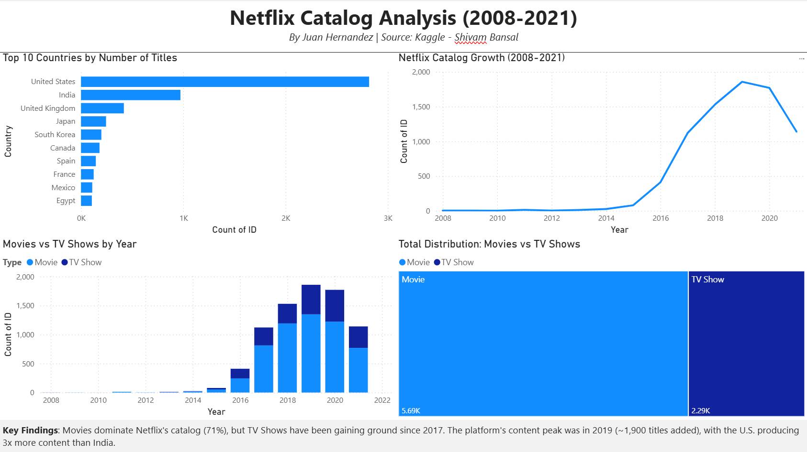

# Netflix Catalog Analysis (2008-2021)

## 📊 Project Overview
This project analyzes Netflix's content catalog using a publicly available 
dataset from Kaggle. The goal is to understand patterns in Netflix's content 
strategy: which countries produce most content, how the catalog has grown 
over time, and how the balance between movies and TV shows has evolved.

## 🎯 Research Questions
1. Which countries produce the most content for Netflix?
2. How has the volume of content added to Netflix changed over time?
3. What is the proportion of Movies vs TV Shows, and how has it evolved?

## 🛠️ Tools Used
- **Power BI Desktop** — for data cleaning, modeling, and visualization
- **Power Query** — for ETL (data cleaning and transformation)

## 📁 Dataset
- **Source:** [Netflix Movies and TV Shows on Kaggle](https://www.kaggle.com/datasets/shivamb/netflix-shows)
- **Author:** Shivam Bansal
- **Size:** ~8,800 titles
- **Time range:** Content added between 2008 and 2021

## 🧹 Data Cleaning Steps (in Power Query)
1. Filtered out 1 row with invalid `Type` value ("William Wyler")
2. Removed rows with null values in `date_added` (~800 rows)
3. Replaced null values in `Country` column with "Unknown"
4. Renamed columns to clean Title Case format (e.g., `show_id` → `ID`, `date_added` → `Date Added`)
5. Verified data types (Date for `Date Added`, Whole Number for `Release Year`)

## 📈 Key Findings

### 1. The U.S. dominates content production
The United States produces approximately **3x more content** than India, 
the second-largest contributor. Asian countries (Japan, South Korea) appear 
in the top 5, reflecting the global rise of Asian entertainment on streaming 
platforms.

### 2. Explosive growth between 2015-2019
Netflix added very little content before 2014. Starting in 2015, the platform 
ramped up aggressively, peaking in **2019 with ~1,900 titles** added in a 
single year. The decline in 2020-2021 may be attributed to COVID-19 production 
disruptions or incomplete data for those years.

### 3. Movies dominate, but TV Shows are catching up
Movies make up **71% of the catalog** (5,690 titles) versus 30% for TV Shows 
(2,290 titles). However, the proportion of TV Shows has been steadily 
increasing since 2017, suggesting Netflix is investing more in series.

## ⚠️ Limitations
- The `Country` column contains multiple comma-separated values for international 
  productions. For simplicity, these were not split into individual countries, 
  meaning combinations like "United States, India" are counted as a single entity.
- Data appears to be incomplete for 2021 (the dataset was last updated in late 
  2021), so the apparent decline that year may not reflect actual Netflix activity.
- ~10% of records were removed due to missing `Date Added` values.

## 📸 Dashboard Preview

## 📂 Files
- `dashboard/Netflix_Catalog_Analysis.pbix` — Power BI source file
- `dashboard/Netflix_Catalog_Analysis.pdf` — PDF export of the dashboard
- `data/netflix_titles.csv` — Original dataset

## 👤 Author
**Juan Hernandez** — Aspiring Data Analyst
- LinkedIn: linkedin.com/in/juanhernandezb
- Email: juanphb7@gmail.com

## 📜 License
This project is licensed under the MIT License - see the [LICENSE](LICENSE) file for details.
